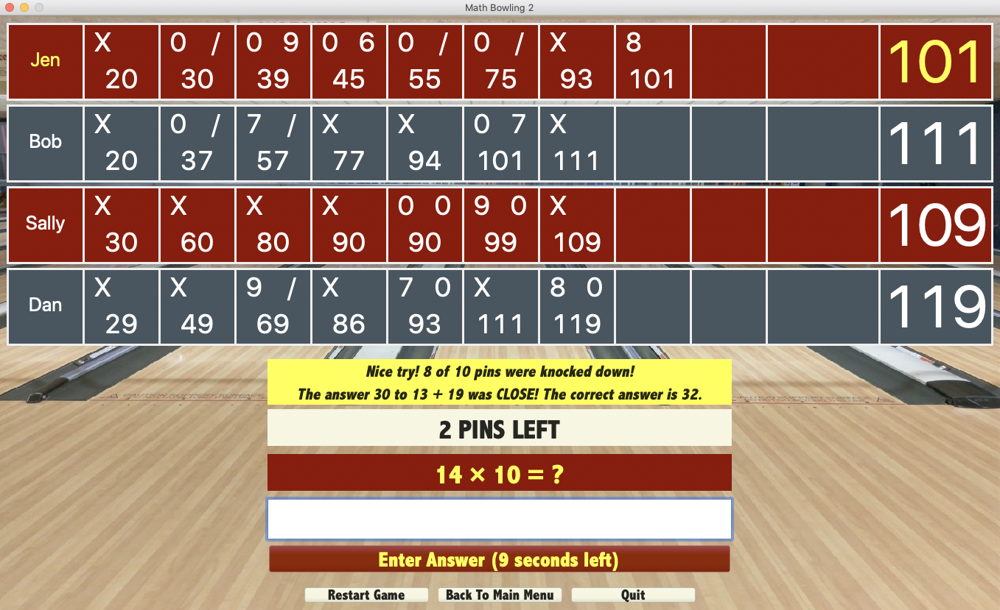

# Math Bowling 2

[Download Math Bowling 2.1.0 for Mac](https://www.dropbox.com/s/3w0ld9zptkiknkv/Math%20Bowling%202-2.1.0.dmg?dl=1)

Math Bowling is an elementary level educational math game.

- [4-Player Demo Video](https://github.com/AndyObtiva/MathBowling/raw/2.0.0/MathBowling-2.0.0-Demo-4Players.mp4) 
- [2-Player Extended Demo Video](https://github.com/AndyObtiva/MathBowling/raw/2.0.0/MathBowling-2.0.0-Demo-2Players.mp4)

Developed with [Glimmer](https://github.com/AndyObtiva/Glimmer) and [JRuby](https://www.jruby.org/).

# Game Rules

[Math Bowling Game Rules](http://AndyObtiva.github.io/MathBowling/game_rules.html)

# Use Cases

1. Start 1 Player Game
1. Start 2 Player Game
1. Start 3 Player Game
1. Start 4 Player Game
1. Answer Math Problem
1. Restart Game
1. Change Player Count
1. Read Game Rules
1. Quit Game

# User Stories / Release Plan

[DONE] 0.1.0 Alpha 1 Release:

1. [DONE] Start game
1. [DONE] Bowl with simple math problem and fixed time limit

[DONE] 0.2.0 Alpha 2 Release:

1. [DONE] Start two player game
1. [DONE] Bowl the player whose turn it is to bowl
1. [DONE] Style with colors and fonts
1. [DONE] Layout content nicely
1. [DONE] Play sound effects for bowling with different sounds for strike/spare, partial knock, and miss

[DONE] 0.9.0 Beta 1 Release:

1. [DONE] Display a splash image when launching game
1. [DONE] Display image for getting a correct, wrong, or close answer.
1. [DONE] Make buttons bigger

[DONE] 0.9.1 Beta 2 Release:

1. [DONE] Center windows
1. [DONE] Add problem answering time limit

[DONE] 0.9.2 Beta 3 Release ([download](https://1drv.ms/u/s!As1vHoYfypJ0gZcDaUq46wxUD1eSoA?e=2ccsHF)):

1. [DONE] Replace image for getting a correct, wrong, or close answer with a video instead.
1. [DONE] Support up to 4 players
1. [DONE] Package for MacOS

[DONE] 0.9.3 Beta 4 Release ([download](https://1drv.ms/u/s!As1vHoYfypJ0gZcGiiaAgr2ywcNisw?e=z1dBIm)):

1. [DONE] Speed up startup time

[DONE] 1.0.0 Release ([download](https://1drv.ms/u/s!As1vHoYfypJ0gZdcxapMZPTQIWKRYA?e=J4sWjN)):

1. [DONE] Adjust Time To Answer from 20 to 30 seconds
1. [DONE] Highlight current player problem with player color
1. [DONE] End of Game Winner Announcement
1. [DONE] Input Validation (positive integers only and limited to 3 digits)
1. [DONE] Menu Options
1. [DONE] Icon/Background for MacOS Package

[DONE] 1.1.0 Release ([download](https://www.dropbox.com/s/d8n1jrhb915r3f1/Math%20Bowling-1.1.0.dmg?dl=1)):
1. [DONE] Spare shot video
1. [DONE] Multiple videos for each scoring type
1. [DONE] Improve wording of buttons and answer result announcements
1. [DONE] Improve difficulty of math problems
1. [DONE] Improve clarity of switching player turns
1. [DONE] Fix issue with game font not showing up on some older Macs
1. [DONE] Fix video scrollbar issue on some older Macs

[DONE] 2.0.0 Release ([download](https://www.dropbox.com/s/af8upm1rh005jzk/Math%20Bowling%202-2.0.0.dmg?dl=1)):

1. [DONE] Multiple math problem difficulties (Easy / Medium / Hard)
1. [DONE] Players can enter name just like in bowling software
1. [DONE] Improve math problem display by adding '= ?' and removing verbose question
1. [DONE] Improve answer result announcement by announcing Strikes, Double Strikes, Triple Strikes, and Spares explicitly (not just with symbols)
1. [DONE] Improve next player announcement by keeping it until player hits enter or presses continue button
1. [DONE] Fix answer result announcement not showing on game over.
1. [DONE] Fix layout issue when switching player count game type after game over
1. [DONE] Fix initial focus on app and game screens
1. [DONE] Fix issue with keyboard focus disappearing when widget tabbing reaches end of cycle

[DONE] 2.1.0 Release ([download](https://www.dropbox.com/s/3w0ld9zptkiknkv/Math%20Bowling%202-2.1.0.dmg?dl=1)):

1. [DONE] Provide option to solve specific math operation problems only (one of + * - /).
1. [DONE] Change time for answering easier + & - operations to 10 seconds only
1. [DONE] Indicate winner names at the end of a game in addition to already displayed winner score
1. [DONE] Improve by not showing the same question twice in a game when possible (and not to the same player otherwise)

2.1.1 Release:

1. Package for Windows
1. Implement correct layout on Windows
1. Add button/label/menu-item mnemonics (for ALT shortcuts)

2.1.2 Release:

1. Package for Linux

# License

Copyright (c) 2019-2020 Andy Maleh. See LICENSE.txt for further details.
