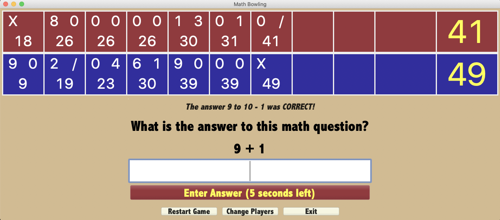

# Math Bowling 1.1.0

[Download Math Bowling 1.1.0 for Mac](https://www.dropbox.com/s/d8n1jrhb915r3f1/Math%20Bowling-1.1.0.dmg?dl=1)

Math Bowling is an elementary level educational math game.

Developed with [Glimmer](https://github.com/AndyObtiva/Glimmer) and [JRuby](https://www.jruby.org/).

# Game Rules

[Math Bowling Game Rules](http://AndyObtiva.github.io/MathBowling/game_rules.html)

# Use Cases

1. Start 1 Player Game
1. Start 2 Player Game
1. Start 3 Player Game
1. Start 4 Player Game
1. Answer Math Problem
1. Restart Game
1. Change Player Count
1. Read Game Rules
1. Quit Game

# User Stories / Release Plan

[DONE] 0.1.0 Alpha 1 Release:

1. [DONE] Start game
1. [DONE] Bowl with simple math problem and fixed time limit

[DONE] 0.2.0 Alpha 2 Release:

1. [DONE] Start two player game
1. [DONE] Bowl the player whose turn it is to bowl
1. [DONE] Style with colors and fonts
1. [DONE] Layout content nicely
1. [DONE] Play sound effects for bowling with different sounds for strike/spare, partial knock, and miss

[DONE] 0.9.0 Beta 1 Release:

1. [DONE] Display a splash image when launching game
1. [DONE] Display image for getting a correct, wrong, or close answer.
1. [DONE] Make buttons bigger

[DONE] 0.9.1 Beta 2 Release:

1. [DONE] Center windows
1. [DONE] Add problem answering time limit

[DONE] 0.9.2 Beta 3 Release ([download](https://1drv.ms/u/s!As1vHoYfypJ0gZcDaUq46wxUD1eSoA?e=2ccsHF)):

1. [DONE] Replace image for getting a correct, wrong, or close answer with a video instead.
1. [DONE] Support up to 4 players
1. [DONE] Package for MacOS

[DONE] 0.9.3 Beta 4 Release ([download](https://1drv.ms/u/s!As1vHoYfypJ0gZcGiiaAgr2ywcNisw?e=z1dBIm)):

1. [DONE] Speed up startup time

[DONE] 1.0.0 Release ([download](https://1drv.ms/u/s!As1vHoYfypJ0gZdcxapMZPTQIWKRYA?e=J4sWjN)):

1. [DONE] Adjust Time To Answer from 20 to 30 seconds
1. [DONE] Highlight current player problem with player color
1. [DONE] End of Game Winner Announcement
1. [DONE] Input Validation (positive integers only and limited to 3 digits)
1. [DONE] Menu Options
1. [DONE] Icon/Background for MacOS Package

[DONE] 1.1.0 Release ([download](https://www.dropbox.com/s/d8n1jrhb915r3f1/Math%20Bowling-1.1.0.dmg?dl=1)):
1. [DONE] Fix issue with game font not showing up on some older Macs
1. [DONE] Fix video scrollbar issue on some older Macs
1. [DONE] Improve wording of buttons and answer result announcements
1. [DONE] Improve difficulty of math problems
1. [DONE] Spare shot video
1. [DONE] Multiple videos for each scoring type
1. [DONE] Improve clarity of switching player turns

2.0.0 Release:

1. Fix odd layout issues on some older Macs
1. Multiple difficulties (Easy, Medium, Hard) with more difficult math problems and shorter answer time
1. Players can choose unique player color to distinguish themselves
1. Players may enter name

2.1.0 Release:

1. Implement correct layout on Windows
1. Package for Windows

2.2.0 Release:

1. Package for Linux

# License

Copyright (c) 2019-2020 Andy Maleh. See LICENSE.txt for further details.
